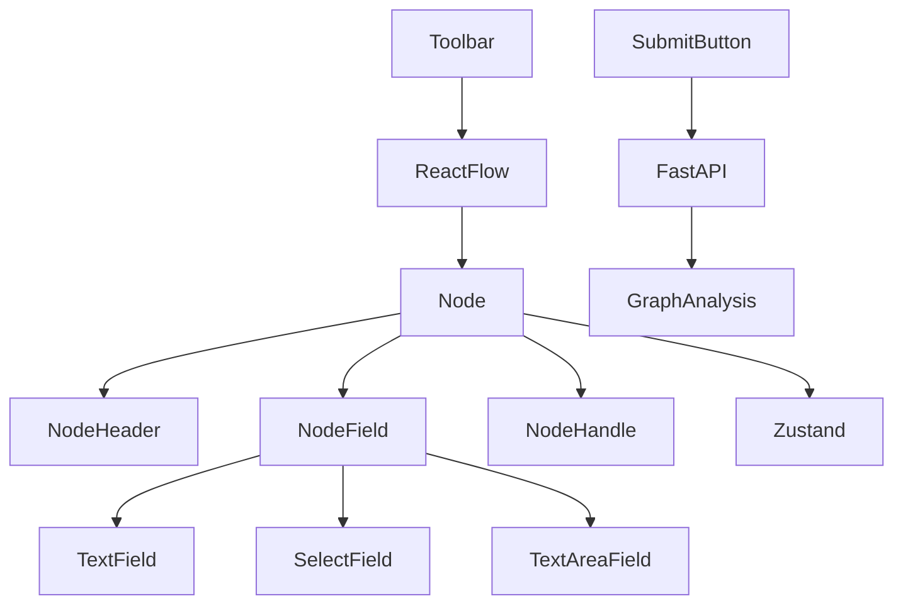

# 🚀 VectorShift Pipeline Builder

A modern drag-and-drop pipeline builder built with **React**, **React Flow**, **Zustand**, and **FastAPI**.

This project was developed as part of the **VectorShift Frontend + Backend Technical Assessment**. It demonstrates reusable component architecture, dynamic node generation, interactive graph editing, automatic variable detection, and backend graph analysis.

---

## ✨ Features

### 🎨 Modern Pipeline Editor

- Drag & Drop node creation
- Interactive graph editor
- Smooth animated connections
- Minimap
- Zoom & Pan controls
- Responsive canvas
- Professional dark UI

---

### 🧩 Reusable Node System

Instead of creating every node separately, the application uses a **configuration-driven architecture**.

Every node is built from a single reusable `Node` component.

Each node only provides its configuration:

- title
- icon
- size
- fields
- handles
- description

This dramatically reduces duplicated code and makes adding new node types extremely simple.

---

### 📦 Supported Nodes

- ✅ Input
- ✅ Output
- ✅ LLM
- ✅ Text
- ✅ API Request
- ✅ PDF Loader
- ✅ Memory
- ✅ Merge
- ✅ Web Search

---

### 📝 Dynamic Text Node

The Text node supports:

- Automatic resizing
- Variable detection
- Dynamic handle generation

Example:

```
Hello {{name}}

Your age is {{age}}
```

Automatically creates:

```
● name

● age

┌───────────────┐
│ Text Node     │
└───────────────┘

          ● output
```

Variables are detected using a JavaScript identifier parser.

---

### 🔗 Backend Integration

The frontend sends the complete pipeline to a FastAPI backend.

The backend computes:

- Number of nodes
- Number of edges
- Whether the graph is a Directed Acyclic Graph (DAG)

Example response:

```json
{
    "num_nodes": 8,
    "num_edges": 7,
    "is_dag": true
}
```

---

# 🏗️ Architecture



---

# 📂 Project Structure

```
Vector-Shift
│
├── frontend
│   ├── src
│   │
│   ├── Components
│   │   ├── Node
│   │   └── fields
│   │
│   ├── configs
│   ├── constants
│   ├── hooks
│   ├── nodes
│   ├── utils
│   ├── store.js
│   ├── ui.js
│   └── toolbar.js
│
└── backend
    └── main.py
```

---

# 🧠 Frontend Architecture

Instead of creating every node individually, nodes are built dynamically.

```
Input Config
        │
Output Config
        │
Text Config
        │
LLM Config
        │
        ▼
Reusable Node Component
        │
        ▼
React Flow
```

---

# 🧩 Node Architecture

```
Node
│
├── Header
│
├── Description
│
├── Fields
│      │
│      ├── TextField
│      ├── SelectField
│      └── TextAreaField
│
└── Handles
```

---

# ⚙️ State Management

State is managed using **Zustand**.

The store manages:

- Nodes
- Edges
- Connections
- Node IDs
- Field Updates

---

# 🔍 Dynamic Variable Detection

Variables inside Text Nodes are detected using regular expressions.

Example:

```
{{name}}
{{email}}
{{user_age}}
```

Produces:

```
name
email
user_age
```

Duplicate variables are automatically removed.

---

# 📈 DAG Detection

The backend determines whether the submitted graph is a Directed Acyclic Graph.

Algorithm used:

- Kahn's Algorithm
- Time Complexity: **O(V + E)**

---

# 🚀 Technologies

## Frontend

- React
- React Flow
- Zustand
- Axios
- Lucide React

## Backend

- FastAPI
- Pydantic
- Python

---

# ⚡ Installation

## Clone

```bash
git clone https://github.com/yourusername/vector-shift.git

cd vector-shift
```

---

## Frontend

```bash
cd frontend

npm install

npm start
```

Runs on:

```
http://localhost:3000
```

---

## Backend

Create virtual environment

```bash
python -m venv venv
```

Activate

### Linux / macOS

```bash
source venv/bin/activate
```

### Windows

```powershell
venv\Scripts\activate
```

Install

```bash
pip install fastapi uvicorn
```

Run

```bash
uvicorn main:app --reload
```

Runs on

```
http://localhost:8000
```

Swagger

```
http://localhost:8000/docs
```

---

# 🧪 Features Tested

- Drag & Drop Nodes
- Dynamic Connections
- Node Deletion
- Dynamic Variable Detection
- Dynamic Handle Generation
- Automatic Node Resizing
- DAG Detection
- Pipeline Submission

---

# 📸 Screenshots

```
Add screenshots here

assets/

home.png

pipeline.png

dynamic-text-node.png
```

---

# 🌟 Future Improvements

- Pipeline persistence
- Custom themes
- Node grouping
- Undo / Redo
- Keyboard shortcuts
- Auto-layout
- Real-time collaboration
- Export / Import JSON
- Node templates

---

# 👨‍💻 Author

**Krishna Sahu**

GitHub

```
https://github.com/krishnasahu22032003
```

Portfolio

```
https://krishnastack.com
```

---

# 📄 License

This project was developed as part of the **VectorShift Technical Assessment**.

For educational and demonstration purposes.